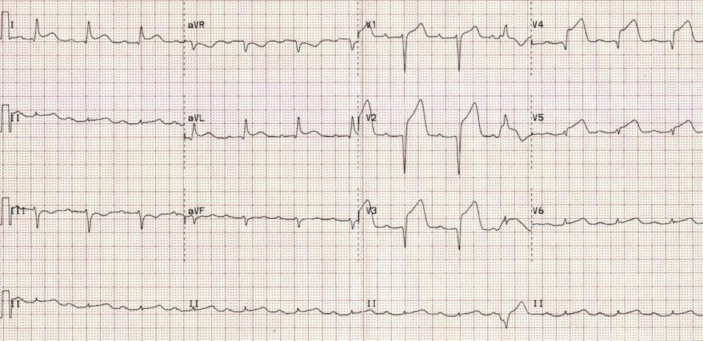

# Exploring accuracy concepts 
 {ignore=True}

#### Mark A. Zaydman1 {ignore=True}

1Department of Pathology and Immunology, Division of Laboratory and Genomic medicine, Washington University in St. Louis, School of Medicine, St. Louis, MO 

## Table of contents {ignore=True}

[TOC]

## Introduction

The purpose of this class activity is to: 1) apply the metrics of analytical accuracy presented in class, and 2) to start to consider the overlap and distinctions between accuracy and value. 
You will be divided into small groups.
Please discuss the questions and the case listed below with your group.
Try to arrive at a consensus position and be prepared to explain your collective reasoning to the class. 

## Questions

**Question 1:**
The area under the ROC curve for two different assays is 0.6 and 0.3.
Which assay is more accurate?

**Question 2:** 
The results of a study (*Giannitsis E et al. 2010 Clin Chem*) evaluating the performance characteristics of a high sensitivity cardiac troponin assay for the diagnosis of NSTEMI are presented in the two-by-two contingency table below:

<block style="margin-left:auto;margin-right:auto;margin-top:40px;margin-bottom:40px">

<table>
  <tr align='center'>
    <th><ins>NSTEMI</ins></th>
    <td>hs-cTN > 14 ng/L (99th%</th>)
    <td>hs-cTN <= 14 ng/L (99th%</th>)
  </tr>
  <tr>
    <td align="right">Diseased</td>
    <td align='center'>125</td>
    <td align='center'>11</td>
  </tr>
  <tr>
    <td align="right">Healthy</td>
    <td align='center'>117</td>
    <td align='center'>250</td>
  </tr>
</table>
</block>

Based upon these data estimate the following:

<table>
    <tr >
        <th align="right">Metric</th>
        <th align="center">Estimate</th>
        <th align="center">Metric</th>        
        <th align="center">Estimate</th>        
    </tr>
    <tr>
        <td align="right">Prevalence:</td>
        <td></td>
        <td align="right">NPV:</td>
        <td></td>   
    </tr>
    <tr>
        <td align="right">Sensitivity:</td>
        <td></td>
        <td align="right">LR+:</td>
        <td></td>   
    </tr>         
    <tr>
        <td align="right">Specificity:</td>
        <td></td>
        <td align="right">LR-:</td>
        <td></td>   
    </tr>
    <tr>
        <td align="right">PPV:</td>
        <td></td>
        <td align="right">DOR:</td>
        <td></td>        
    </tr>             
</table>

&nbsp;

**Question 3:** 

A 50 year old man with a history of HTN, HLD, T2DM, and obesity presents to the ED with squeezing chest pain, shortness of breath, and dizziness. 
On physical exam he is pale, diaphoretic, and in apparent discomfort.

A STAT ECG was obtained and is shown below:

What is the most appropriate next step in management?

1. Order CK-MB
2. Order LDH
3. Order conventional cardiac troponins
4. Order high sensitivity cardiac troponins
5. Cardiac catheterization