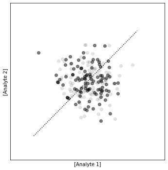
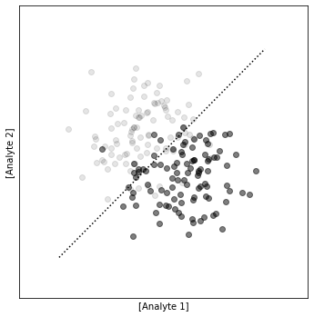
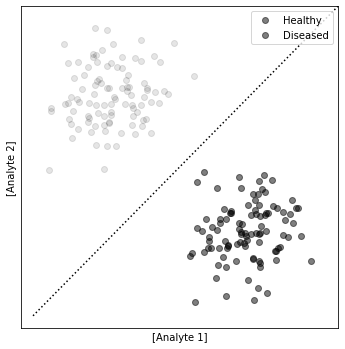

---

marp: true
theme: default
color: #000
backgroundColor: #fff
paginate: true
enableHtml: true	

---
# TEST ACCURACY

Clinical Informatics Lecture

Mark A. Zaydman MD, PhD
September 22, 2022

---

# Learning objectives

- Develop an intuitive understanding of analytical accuracy
- Define common metrics of analytical accuracy
- Apply accuracy based metrics to evaluate a diagnostic test

 

Course materials at: https://github.com/MarkZaydman/Lecture-TestAccuracy.git

---

# Why this lecture matters

- Critically evaluating laboratory tests is a core function of a clinical pathologist

- Accuracy metrics are highly testable

 

---
# 2x2 Contingency Tables

<block style="margin-left:auto;margin-right:auto;margin-top:40px;margin-bottom:40px">

<table>
  <tr align='center'>
    <th><ins>Disease Status</ins></th>
    <td>Test Positive</th>
    <td>Test Negative</th>
  </tr>
  <tr>
    <td align="right">Diseased</td>
    <td align='center'>True Positive (TP)</td>
    <td align='center'>False Negative (FN)</td>
  </tr>
  <tr>
    <td align="right">Healthy</td>
    <td align='center'>False Positive (FP)</td>
    <td align='center'>True Negative (TN)</td>
  </tr>
</table>
</block>

Instead of focusing on this table this lecture aims to develop an intuition of test accuracy

---

# What is the point of performing a diagnostic test?

*Prevalence =0.1*
___

# An ideal test fully separates healthy & diseased

   

---

# An useless test does not separate healthy & diseased

   

---

# An realistic test partially separates healthy & diseased

   

---

  

# <ins>Test Accuracy</ins>
#### The degree to which results from healthy and diseased individuals can be separated by a decision boundary (diagnostic threshold)
 

---

# Concepts To Be Discussed Today
1. Sensitivity, Specificity, and ROCC Analysis
2. Positive and Negative Predictive Values
3. Likelihood Ratios and Diagnostic Odds Ratio
<!-- 4. Precision, Recall, and F-score -->

---

# Sensitivity, Specificity, and ROCC Analysis
---

# Sensitivity ($Se$)

 $Se=\frac{TP}{TP+FN}$ 

1. $Se$ is the fraction of diseased individuals that test positive
2. $Se$ varies from zero to one
3. $Se$ decreases with increasing threshold value

---

# Sensitivity calculation example

 

<!-- <block align="center">
Sensivity depends only on the results for diseased individuals
</block> -->

---

# Does disease prevalence affect sensitivity?

A. Yes
B. No

---

# Specificity ($Sp$)

 $Sp=\frac{TN}{FP+TN}$ 

1. $Sp$ is the fraction of healthy individuals that do not test positive
2. $Sp$ varies from zero to one
3. $Sp$ increases with increasing threshold value

---

# Specificity calculation example

 

<!-- <block align="center">
Specificity depends only on the results for healthy individuals
</block> -->

---

# Does disease prevalence affect specificity?

A. Yes
B. No

---

# Receiver operating characteristic curves (ROCC)

 

Graphical plot summarizing the trade off between $Se$ and $Sp$ across varying thresholds 

---
# Area under the ROCC curve (AUROCC or C-statistic)

<block align=center>
 
</block>

<block align=center>
 
</block>

$$AUROCC=P([Analyte]_{d_i}>[Analyte]_{h_j})$$ 
<!-- Where $d_i$ and $h_j$ are randomly selected selected diseased and healthy individual respectively -->

---
# Does disease prevalence affect ROCC analysis?

A. Yes
B. No

---

# ROCC curves are not affected by prevalence

<block align=center>
 

 
</block>

---

# Positive and Negative Predictive Values

---

# Positive Predictive Value ($PPV$)

 $PPV=\frac{TP}{TP+FP}$ 

1. $PPV$ is the fraction of individuals with a positive test result that have the disease
2. $PPV$ varies from zero to one
3. $PPV$ increases with increasing threshold value

---

# PPV calculation example

<block align="center">
 
</block>
<!-- <block align="center">
PPV depends only on the results for healthy <ins>and</ins> diseased individuals
</block> -->

---
# Does disease prevalence affect PPV?

A. Yes
B. No

---

# Negative Predictive Value ($NPV$)

 $NPV=\frac{TN}{TN+FN}$ 

1. $NPV$ is the fraction of individuals with a negative test result that are healthy
2. $NPV$ varies from zero to one
3. $NPV$ increases with increasing threshold value

---

# NPV calculation example

<block align="center">
 
</block>

<!-- <block align="center">
NPV depends only on the results for healthy <ins>and</ins> diseased individuals
</block> -->

---
# Does disease prevalence affect NPV?

A. Yes
B. No

---

# Likelihood Ratios and Diagnostic Odds Ratio

---

# Positive Likelihood Ratio ($LR^+$)

<block>

 $LR^+=\frac{\frac{TP}{TP+FN}}{\frac{FP}{TN+FP}}=\frac{Se}{1-Sp}$

</block>

1. $LR^+$ is how many times more likely is a test positive result for diseased individual
2. $LR^+$ varies from zero to $\infty$
<!-- 3. $LR^+$ increases with increasing threshold value -->

---

# $LR^+$ calculation example

<block align="center">
 
</block>

<!-- <block align="center">
LR+ 
</block> -->

---
<!-- # Does disease prevalence affect $LR^+$?

A. Yes
B. No

--- -->

# Negative Likelihood Ratio ($LR^-$)

<block>

 $LR^-=\frac{\frac{FN}{TP+FN}}{\frac{TN}{TN+FP}}=\frac{1-Se}{Sp}$ 

</block>

1. $LR^-$ is how many times less likely is a negative test is for a diseased individual
2. $LR^-$ varies from zero to $\infty$
<!-- 3. $LR^+$ increases with increasing threshold value -->

---

# $LR^-$ calculation example

<block align="center">
 
</block>
<!-- <block align="center" style="color:black;background-color:red">
This is not right- 
</block> -->

---

# Likelihood ratios give a direct relationship between posttest and pretest odds 

<block align="center">

 

$Odds^{Post|+}=LR^{+}*Odds^{Pre}$

$Odds^{Post|-}=LR^{-}*Odds^{Pre}$

  

$Odds(Disease)=\frac{p(Disease)}{1-p(Disease)}$
</block>

 
 
*See handout for proof

---
# Does disease prevalence affect $LR^+$ or $LR^-$?

A. Yes
B. No

---

# Diagnostic Odds Ratio ($DOR$)

<!--  -->
$$DOR=\frac{LR^+}{LR^-}=\frac{\frac{\frac{TP}{TP+FN}}{\frac{FP}{FP+TN}}}{\frac{\frac{FN}{TP+FN}}{\frac{TN}{FP+TN}}}=\frac{TP*TN}{FP*FN}$$

1. $DOR$ is a global measure of diagnostic accuracy
2. $DOR$ varies from zero to $\infty$
   
   - $DOR<1\rightarrow$ Backwards Test
   - $DOR=1\rightarrow$ Useless Test
   - $1<DOR<\infty\rightarrow$ Realistic test test
   - $DOR=\infty\rightarrow$ Perfect test

<!-- <table style="text-align:center">
  <tr> 
    <th><ins>DOR</ins></th>
    <th><ins>Interpretation</ins></th>
  </tr>
  <tr>
    <td><math>DOR&lt1</math></th>
    <td>Backwards Test</th>
  </tr>
  <tr>    
  <td><math>DOR=1</math></th>
    <td>Useless Test</th>
  </tr>
  <tr>
    <td><math>1&ltDOR&lt&infin;</math></th>
    <td>Realistic Test</th>
  </tr>
  <tr>
    <td><math>DOR=&infin;</math></th>
    <td>Perfect Test</th>
  </tr>
</table> -->

<!-- 3. $LR^+$ increases with increasing threshold value -->

---

# $DOR$ calculation example

<block align="center">
 
</block> 

$$DOR=\frac{LR^+}{LR^-}=\frac{9.5}{0.22}=43.18$$
<!-- <block align="center">
LR- 
</block> -->

---
# Does disease prevalence affect $DOR$?

A. Yes
B. No

<!-- --- -->

<!-- # Precision, Recall, and F-score -->

---

# DOR gives a direct relationship between posttest odds associated with positive and negative test

<block align="center">

 

$Odds^{Post|+}=DOR*Odds^{Post|-}$
 
*See handout for proof
</block>

___

# Conclusions

  

- Accuracy is the degree to which a boundary can be drawn to separate analyte values from healthy and diseased individuals

- Accuracy is a critical determinant of the usefullness of a test

---

# Extending beyond one dimension 

<!--  -->

  
<!--    -->

---

# So many synonyms, so little time....

 

$$Sensitivity = recall = TPR$$

$$PPV = precision$$

$$etc.=etc.=etc.$$

 

***See your class handout for additional info**

---

Course materials at: https://github.com/MarkZaydman/PathologyInformatics_2021.git

---

<!-- # Review: Prevalence and Accuracy Metrics -->

<block style="margin-left:auto;margin-right:auto;">
<table style="text-align:center;">
<tr>
  <th><ins>Metric</ins></th>
  <!-- <th><ins>Affected by Prevalence</ins></th> -->
  <th><ins>Trend with Increasing Prevalence</ins></th>
</tr>
<tr>
  <td>Sensitivity</td>
  <td>No Change</td>
</tr>
<tr>
  <td>Specificity</td>
  <td>No Change</td>
</tr>
<tr>
  <td>Area Under ROCC</td>
  <td>No Change</td>
</tr>
<tr>
  <td style="color:green">Positive Predictive Value</td>
  <td style="color:green">Increase</td>
</tr>
<tr>
  <td style="color:red">Negative Predictive Value</td>
  <td style="color:red">Decrease</td>
</tr>
<tr>
  <td>Positive Likelihood Ratio</td>
  <td>No Change</td>
</tr>
<tr>
  <td>Negative Likelihood Ratio</td>
  <td>No Change</td>
</tr>
<tr>
  <td>Diagnostic Odds Ratio</td>
  <td>No Change</td>
</tr>
<!-- <tr>
  <td style="color:green">Precision</td>
  <td style="color:green">Increase</td>
</tr>
<tr>
  <td>Recall</td>
  <td>No Change</td>
</tr>
<tr>
  <td style="color:green">F-score</td>
  <td style="color:green">Increase</td>
</tr> -->
</table>
</block>
